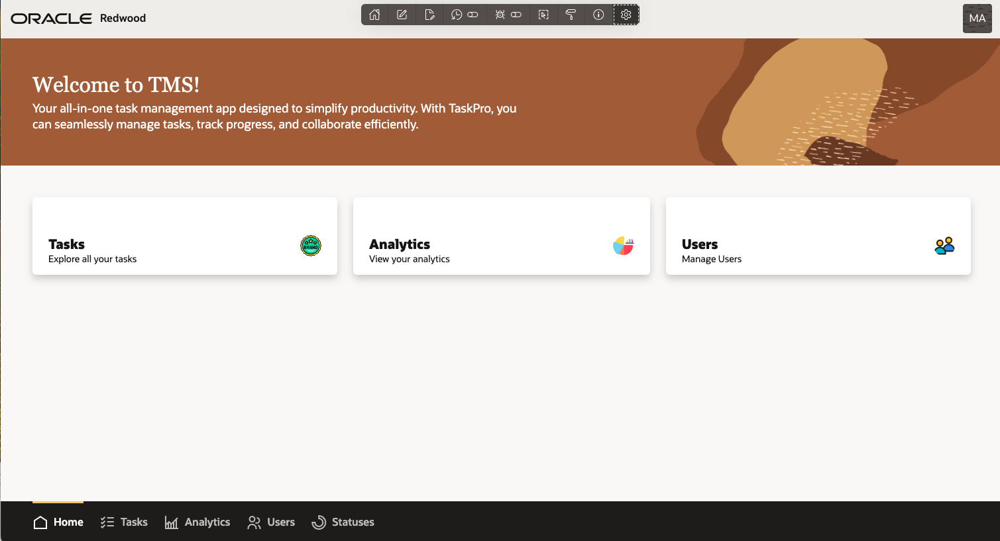
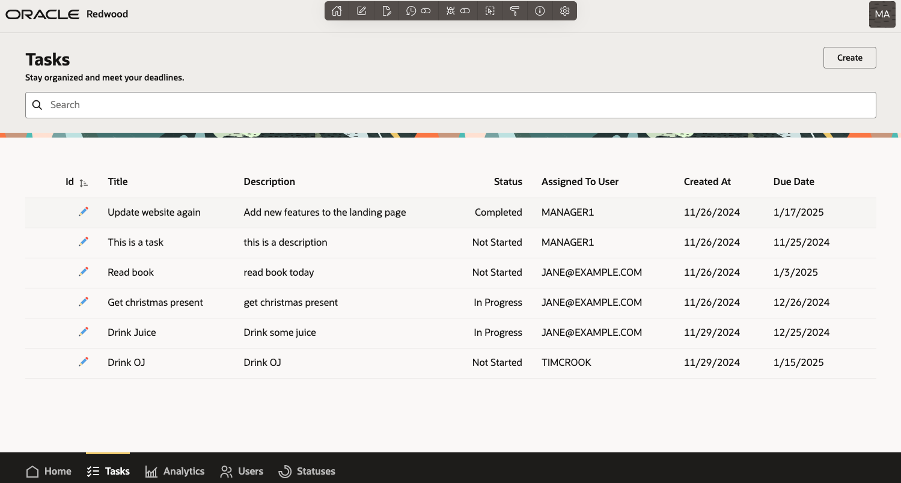
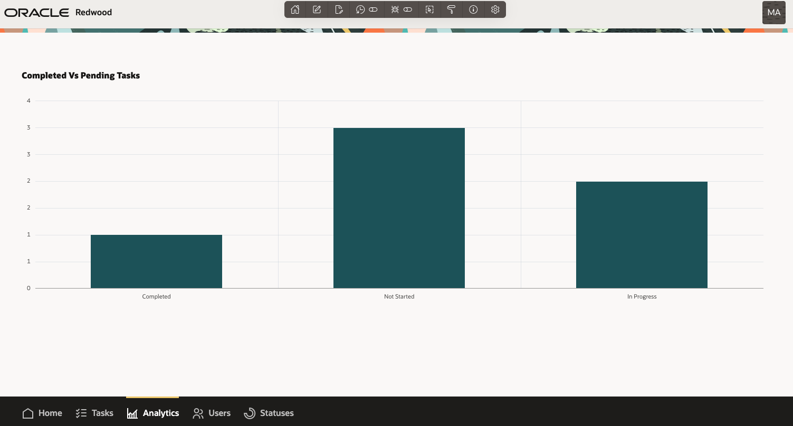

# Task Management System - Oracle APEX

## Overview
This is a Task Management System built using Oracle APEX. The application is designed to help users manage their tasks efficiently, with built-in oracle apex role-based access controls for administrators. It features four core pages: **Home**, **Tasks**, **Analytics**, **Statuses** and **Users**.

## Features
- **Home Page**: Splash pages linking to other pages.
- **Tasks Page**: Manage tasks (add, edit, delete, and filter).
- **Statuses Page (Admin Only)**: Manage Statuses
- **Analytics Page (Admin Only)**: Simple reports for task data.
- **Users Page (Admin Only)**: View application users.

## Technologies Used
- **Oracle APEX**: Low-code application platform.
- **SQL and PL/SQL**: Backend data manipulation and logic.
- **HTML, CSS, JavaScript**: UI enhancements, dynamic actions, stored procedures.

## Setup Instructions
1. Create the required database schema using the scripts provided in `src/database.zip`.
2. Import the `src/f48095.zip` into your Oracle Apex workspace
3. Populate the application with sample data (tasks, statuses).
4. Assign admin roles via the `shared Components \ Application Access Control` to appropriate users for accessing restricted pages.
5. Run the application and explore its features.

## Demo

## Future Enhancements
- Add notification reminders for tasks nearing their deadlines.
- Integrate task assignment with email notifications.

## Contact
For questions or feedback, feel free to reach out!
